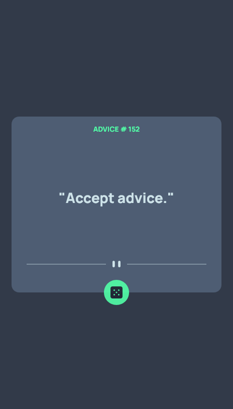

# Frontend Mentor - Advice generator app solution

This is a solution to the [Advice generator app challenge on Frontend Mentor](https://www.frontendmentor.io/challenges/advice-generator-app-QdUG-13db). Frontend Mentor challenges help you improve your coding skills by building realistic projects.

## Table of contents

- [Overview](#overview)
  - [The challenge](#the-challenge)
  - [Screenshot](#screenshot)
  - [Links](#links)
- [My process](#my-process)
  - [Built with](#built-with)
  - [What I learned](#what-i-learned)
  - [Useful resources](#useful-resources)
- [Author](#author)

## Overview

### The challenge

Your challenge is to build out this advice generator app using the [Advice Slip API](https://api.adviceslip.com) and get it looking as close to the design as possible.

You can use any tools you like to help you complete the challenge. So if you've got something you'd like to practice, feel free to give it a go.

Users should be able to:

- View the optimal layout for the app depending on their device's screen size
- See hover states for all interactive elements on the page
- Generate a new piece of advice by clicking the dice icon
 

### Screenshot

### Links

- Solution URL: [My Solution](https://github.com/snelson-seattle/fm-advice-generator)

## My process

### Built with

- HTML5
- SASS for CSS
- Flexbox
- Mobile-first workflow
- [React](https://reactjs.org/) - JS library

### What I learned

This project was good practice using ReactJS. It incorporates several common React Hooks (useState, useEffect, createContext, useContext) to achieve application functionality. I was also able to practice using "new" SASS syntax (Dart SASS) with ReactJS. 

### Useful resources

- [Glowing Hover Effect](https://codersblock.com/blog/creating-glow-effects-with-css/) - This helped me figure out the glowing hover effect on the button using CSS. I really like this effect and will use it in future projects.

## Author

- Website - [https://www.scottenelson.com](https://www.scottenelson.com)
- LinkedIn - [www.linkedin.com/in/scottenelson](www.linkedin.com/in/scottenelson)
- GitHub - [https://github.com/snelson-seattle](https://github.com/snelson-seattle)

